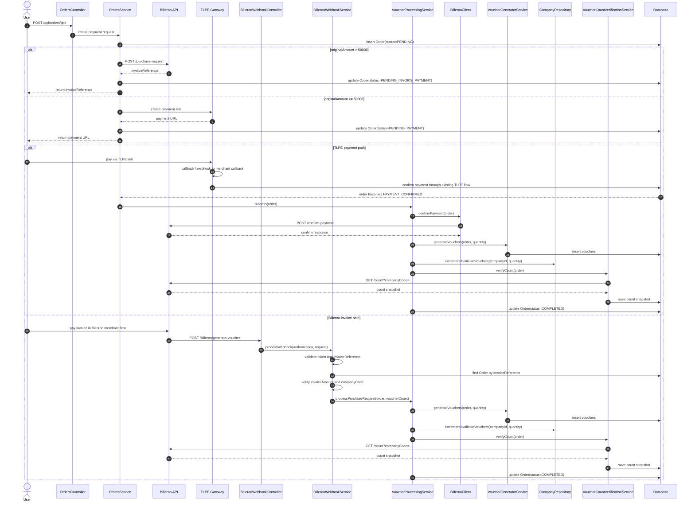

# Voucher Flow Documentation

This document traces the actual flow in this workspace from TLPE payment creation to Billeroo-backed voucher generation, plus the company-sync and voucher-redeem paths that also touch Billeroo.

## Source Map

- [OrdersController.java](src/main/java/com/dci/clearance/controller/OrdersController.java)
- [OrdersService.java](src/main/java/com/dci/clearance/service/OrdersService.java)
- [MerchantCallbackController.java](src/main/java/com/dci/clearance/merchantCallback/controller/MerchantCallbackController.java)
- [MerchantCallbackService.java](src/main/java/com/dci/clearance/merchantCallback/service/MerchantCallbackService.java)
- [VoucherController.java](src/main/java/com/dci/clearance/generateVoucher/controller/VoucherController.java)
- [BillerooWebhookController.java](src/main/java/com/dci/clearance/generateVoucher/controller/BillerooWebhookController.java)
- [VoucherProcessingService.java](src/main/java/com/dci/clearance/generateVoucher/service/VoucherProcessingService.java)
- [BillerooClient.java](src/main/java/com/dci/clearance/generateVoucher/client/BillerooClient.java)
- [CompanyService.java](src/main/java/com/dci/clearance/service/CompanyService.java)
- [VoucherService.java](src/main/java/com/dci/clearance/service/VoucherService.java)
- [BillerooRedeemClient.java](src/main/java/com/dci/clearance/service/BillerooRedeemClient.java)

## End-To-End Flow

## 1. TLPE Payment Creation

### API purpose

- `POST /api/orders/tlpe` creates a payment request, stores an `Order`, and returns either a TLPE payment link or a Billeroo invoice reference.
- The implementation lives in [OrdersController.java](src/main/java/com/dci/clearance/controller/OrdersController.java) and [OrdersService.java](src/main/java/com/dci/clearance/service/OrdersService.java).

### What happens

1. The controller accepts `OrdersRequest` and authenticated user context.
2. `OrdersService` resolves the current user and company, validates the request, and inserts an order with `status = PENDING`.
3. If `originalAmount > 50000`, the flow uses Billeroo immediately as a purchase-request/invoice path:
   - `BillerooClient.createPurchaseRequest(...)` sends `POST /purchase-request`.
   - The returned invoice reference is stored on the order.
   - The order becomes `PENDING_INVOICE_PAYMENT`.
4. If the amount is at or below the threshold, the flow uses TLPE directly:
   - The merchant reference is injected into the TLPE payload.
   - TLPE returns a payment URL.
   - The order becomes `PENDING_PAYMENT`.

## 2. TLPE Confirmation and Billeroo Invoice Webhook

### API purpose

- `GET /api/merchant-callback/payment-result` is the browser redirect landing endpoint.
- `POST /api/merchant-callback/payment-result` accepts the webhook body from TLPE.
- `GET /api/merchant-callback/summary/{transactionId}` is the direct confirmation endpoint that fetches TLPE `/report` and updates the order.
- These endpoints are defined in [MerchantCallbackController.java](src/main/java/com/dci/clearance/merchantCallback/controller/MerchantCallbackController.java).

### What happens

1. TLPE returns the user or posts a webhook after payment.
2. `MerchantCallbackService.verifyAndConfirm(transactionId)` calls TLPE `/report` through `TransactionVerificationService`.
3. The order is matched by `merchantReferenceId` or `tlpeTransactionId`.
4. The service updates the order to:
   - `PAYMENT_VERIFYING` while the report is being processed
   - `PAYMENT_CONFIRMED` when TLPE confirms success
   - `FAILED` when the report indicates failure
5. If the order is `PAYMENT_CONFIRMED` and Billeroo has not yet been used, the service auto-triggers voucher generation by calling `VoucherProcessingService.process(order)`.
6. The `process` method returns a `BilleroConfirmResult` detailing the success or failure from Billeroo.
7. An `OrderUpdateResult` wraps both the TLPE report and the `BilleroConfirmResult`, which `MerchantCallbackMapper` uses to accurately map the `voucherStatusLabel` (e.g., "Voucher Generated Successfully", "Unable to confirm voucher", or "Voucher already processed").

### Billeroo invoice webhook path

For orders above the threshold, the payment confirmation signal does not come from TLPE. It comes from Billeroo's merchant webhook instead.

1. Billeroo sends `POST /billeroo/generate-voucher` after the invoice is paid.
2. The payload includes:
   - `timestamp`
   - `invoiceReference`
   - `invoiceAmount`
   - `voucherCount`
   - `companyCode`
3. `BillerooWebhookService.processWebhook(...)` validates the Billeroo token from `merchant-callback.billero-token`.
4. The service finds the local order by `invoiceReference`.
5. It verifies `invoiceAmount` and `companyCode` against the order row.
6. If the order is still payable, it calls `VoucherProcessingService.processPurchaseRequest(order, voucherCount)`.
7. Voucher generation then continues from the existing Billeroo-backed voucher flow and inserts the generated vouchers for that company.

## 3. Billeroo Voucher Generation Path

### API purpose

- `POST /api/vouchers/process` is the manual or retry entrypoint for Billeroo-backed voucher generation after a TLPE payment is already confirmed.
- The endpoint lives in [VoucherController.java](src/main/java/com/dci/clearance/generateVoucher/controller/VoucherController.java).
- It is guarded so it only processes orders in `PAYMENT_CONFIRMED` and skips orders already marked as Billeroo confirmed.

### Main service flow

`VoucherProcessingService.process(order)` is the primary path.

1. It calls `BillerooClient.confirmPayment(order)`.
2. `BillerooClient` sends a `BillerooConfirmRequest` to Billeroo `POST /confirm-payment`.
3. If Billeroo replies with an already-processed condition, the client treats it as success to keep the flow idempotent.
4. The order is updated to `BILLEROO_CONFIRMED` and marked with `billerooConfirmed = true`.
5. Voucher rows are generated by `VoucherGeneratorService.generateVouchers(order, quantity)`.
6. The company’s local voucher count is incremented with `CompanyRepository.incrementAvailableVouchers(...)`.
7. `VoucherCountVerificationService.verifyCount(order)` calls Billeroo `GET /count` and stores a `VoucherCountSnapshot` with:
   - Billeroo available / redeemed / cancelled / total
   - Local available count
   - sync flag and discrepancy
8. If everything succeeds, the order becomes `COMPLETED`.
9. If anything fails, the order is marked failed in a new transaction so the failure status survives rollback.

### Billeroo webhook shortcut

- `POST /billeroo/generate-voucher` enters through [BillerooWebhookController.java](src/main/java/com/dci/clearance/generateVoucher/controller/BillerooWebhookController.java).
- `BillerooWebhookService` validates `merchant-callback.billero-token`, locates the order by `invoiceReference`, checks `invoiceAmount` and `companyCode`, and then skips `confirm-payment` because the Billeroo merchant webhook is the signal that payment already succeeded.
- It directly calls `VoucherProcessingService.processPurchaseRequest(order, voucherCount)`.

## 4. Company Sync with Billeroo

### API purpose

- `POST /api/companies`, `PUT /api/companies/{id}`, and `POST /api/companies/bulk` all keep the local company record in sync with Billeroo.
- These endpoints are defined in [CompanyController.java](src/main/java/com/dci/clearance/controller/CompanyController.java).

### What happens

1. `CompanyService.create`, `update`, and `bulkCreate` persist the company locally first.
2. They then call `BillerooClient.syncCompany(company)`.
3. `BillerooClient` converts the company to `BillerooCompanySyncRequest` and sends `PUT /company` to Billeroo.
4. The payload includes:
   - company code
   - email
   - name
   - active/inactive status as `1` or `0`
5. This keeps Billeroo’s company master aligned with local CRUD changes.

## 5. Voucher Redeem Path Connected to Billeroo

### Important distinction

- The endpoint `POST /api/vouchers/redeem` in the legacy voucher controller only marks a local `Purchase` as redeemed.
- The confirmation for that endpoint is the local database update in `VoucherService.redeemVoucher(...)`, which sets the purchase status to `REDEEMED` and stores `redeemedOn`.
- The Billeroo-connected redeem flow is different: it lives in `VoucherService.redeemVoucherByCode(...)` and uses `BillerooRedeemClient`.
- The Billeroo notification path is `POST /billeroo/voucher-redeem`, which double-checks the redemption event and can confirm the voucher was already redeemed.

### API purpose

- `BillerooRedeemClient.redeem(transactionReference, companyCode)` performs the Billeroo redeem call using a `PATCH` request.
- The client is used by `VoucherService.redeemVoucherByCode(...)`.
- `POST /billeroo/voucher-redeem` is the incoming third-party notification webhook for redemption confirmation.

### What happens

1. A voucher is loaded by voucher code.
2. The voucher must still be `AVAILABLE`.
3. The service calls Billeroo with:
   - `transactionReference = certNo`
   - `companyCode = voucher.companyCode`
   - `voucherCount = 1`
4. Billeroo returns a `voucherReference` array in the response body.
5. The local voucher is then marked `REDEEMED` and timestamped.
6. If Billeroo returns no reference or an error, the local record is still updated, but the Billeroo result is logged so the integration can be audited.

### Voucher redeem notification webhook

- `POST /billeroo/voucher-redeem` enters through [BillerooWebhookController.java](src/main/java/com/dci/clearance/generateVoucher/controller/BillerooWebhookController.java).
- It uses [VoucherRedeemWebhookDto](src/main/java/com/dci/clearance/dto/VoucherRedeemWebhookDto.java) for the payload.
- `BillerooWebhookService.processVoucherRedeemWebhook(...)` validates the request using `merchant-callback.billero-token`.
- It resolves the voucher by `transactionReference` first, then falls back to `voucherReference` if needed.
- If the voucher is already `REDEEMED`, the webhook acts as a confirmation check and returns successfully without changing the existing status.
- If the voucher is still `AVAILABLE`, the webhook sets `status = REDEEMED`, stores `redeemedAt`, and saves the Billeroo `voucherReference`.
- The webhook also checks `companyCode`, `statusCode`, and `voucherAmount` before confirming the update.

### `/api/vouchers/redeem` confirmation

- `POST /api/vouchers/redeem` remains the legacy local redeem endpoint for `Purchase` records.
- Its success result is confirmed by the service itself, because `VoucherService.redeemVoucher(...)` updates the database immediately and returns `Voucher redeemed successfully`.
- For Billeroo-backed vouchers, the stronger confirmation path is the `/billeroo/voucher-redeem` webhook, which can be used to verify that the external redemption notification was received and matched to the local voucher row.

## 6. API Purpose Summary

| Endpoint | Purpose | Billeroo involvement |
| --- | --- | --- |
| `POST /api/orders/tlpe` | Create order and start payment | Yes, only for high-value orders via `/purchase-request` |
| `GET /api/merchant-callback/payment-result` | Handle redirect after TLPE payment | No direct Billeroo call; verifies TLPE report |
| `POST /api/merchant-callback/payment-result` | Accept TLPE webhook payload | No direct Billeroo call; verifies TLPE report |
| `GET /api/merchant-callback/summary/{transactionId}` | Confirm payment and update order | No direct Billeroo call; downstream voucher processing may use Billeroo |
| `POST /api/vouchers/process` | Trigger Billeroo voucher generation after confirmed payment | Yes, confirms payment then generates vouchers |
| `POST /billeroo/generate-voucher` | Billeroo invoice webhook for purchase requests | Yes, skips confirm-payment and generates vouchers directly |
| `POST /billeroo/voucher-redeem` | Billeroo redemption notification webhook | Yes, confirms or double-checks redeemed vouchers |
| `POST /api/companies`, `PUT /api/companies/{id}`, `POST /api/companies/bulk` | Maintain company master data | Yes, syncs the company with `/company` |
| Billeroo-backed voucher redeem | Redeem a voucher against Billeroo | Yes, via `PATCH` redeem endpoint |

## 7. Practical Reading Order

If you want to trace the runtime behavior quickly, read these files in order:

1. [OrdersController.java](src/main/java/com/dci/clearance/controller/OrdersController.java)
2. [OrdersService.java](src/main/java/com/dci/clearance/service/OrdersService.java)
3. [MerchantCallbackController.java](src/main/java/com/dci/clearance/merchantCallback/controller/MerchantCallbackController.java)
4. [MerchantCallbackService.java](src/main/java/com/dci/clearance/merchantCallback/service/MerchantCallbackService.java)
5. [VoucherController.java](src/main/java/com/dci/clearance/generateVoucher/controller/VoucherController.java)
6. [VoucherProcessingService.java](src/main/java/com/dci/clearance/generateVoucher/service/VoucherProcessingService.java)
7. [BillerooClient.java](src/main/java/com/dci/clearance/generateVoucher/client/BillerooClient.java)
8. [CompanyService.java](src/main/java/com/dci/clearance/service/CompanyService.java)
9. [VoucherService.java](src/main/java/com/dci/clearance/service/VoucherService.java)
10. [BillerooRedeemClient.java](src/main/java/com/dci/clearance/service/BillerooRedeemClient.java)

## 8. Known Gotchas and Fixes

### Citizen Company Code Overwrite Bug
- **Symptom**: A Citizen registers and gets a 3-character shadow company code (e.g., `T3Q`). Later, their company code unexpectedly changes to `CMP-XXXXXXXX`.
- **Cause**: The `DataInitializer` loops over all users on application startup to ensure they have a `companyCode` and `branchRef`. Since Citizen shadow companies do not have branches (`branchRef` is null), the initializer falsely identified their profile as incomplete and overwrote their `companyCode` with a new `CMP-` code and generated a branch.
- **Fix**: The condition in `DataInitializer` was updated to explicitly skip `CITIZEN` users if they already have a `companyCode`, ensuring their 3-character codes are preserved across backend restarts.

### Hardcoded "Unable to confirm voucher" Label
- **Symptom**: The frontend TLPE payment summary always displayed "Unable to confirm voucher" even if the voucher was successfully generated.
- **Cause**: Previously, `MerchantCallbackService` mapped the TLPE report directly into the frontend response and passed `null` for the Billeroo status, falling back to a hardcoded failure string.
- **Fix**: The service was refactored to return an `OrderUpdateResult` combining the TLPE report and the `BilleroConfirmResult` returned by `VoucherProcessingService.process(order)`. `MerchantCallbackMapper` now accurately maps the label to "Voucher Generated Successfully" or "Voucher already processed" based on Billeroo's actual response.
