# Full End-to-End Voucher Flow Documentation

This document serves as the comprehensive guide to how the system handles voucher purchases, starting from the moment the user clicks "Pay", to the TLPE Webhook, and finally concluding with the Billeroo API integration and Voucher Generation.

## Flow Diagram

```mermaid
sequenceDiagram
    autonumber
    actor User
    participant Friend as Friend's UI / Backend
    participant TLPE as TLPE Gateway
    participant Webhook as MerchantWebhookService
    participant VC as VoucherController
    participant VPS as VoucherProcessingService
    participant Billeroo as Billeroo API
    participant DB as MySQL Database

    User->>Friend: Clicks "Proceed to Payment"
    Friend->>DB: INSERT INTO orders (status='PENDING')
    Friend->>TLPE: Request Payment Link
    TLPE-->>Friend: Return Payment URL
    Friend->>DB: UPDATE orders SET status='PENDING_PAYMENT'
    Friend-->>User: Redirect to TLPE URL
    User->>TLPE: Completes Payment

    %% TLPE Webhook Flow
    TLPE->>Webhook: Send Webhook JWT Payload
    Webhook->>Webhook: Validate JWT & Claims
    Webhook->>DB: (Friend's logic) UPDATE orders SET tlpe_transaction_id, status='PAYMENT_VERIFYING'
    Webhook->>Friend: Stream Event / Trigger Report
    Friend->>TLPE: GET /report (Verify Payment)
    TLPE-->>Friend: Status OK.00.00
    Friend->>DB: UPDATE orders SET payment_reference, status='PAYMENT_CONFIRMED'

    %% Billeroo Handoff
    Friend->>VC: POST /api/vouchers/process { orderId: 123 }
    VC->>DB: SELECT order WHERE status='PAYMENT_CONFIRMED'
    VC->>VPS: process(order)
    
    rect rgb(30, 40, 50)
        note right of VPS: VoucherProcessingService (@Transactional)
        VPS->>Billeroo: POST /voucher/confirm-payment
        Billeroo-->>VPS: 200 OK
        VPS->>DB: UPDATE orders SET billeroo_confirmed = 1, status = 'BILLEROO_CONFIRMED'
        
        VPS->>VPS: Generate Unique Codes
        VPS->>DB: INSERT INTO vouchers (N rows)
        VPS->>DB: UPDATE companies SET available_vouchers += N
        
        VPS->>Billeroo: GET /voucher/count
        Billeroo-->>VPS: Return { available, redeemed, etc. }
        VPS->>DB: INSERT INTO voucher_count_snapshots
        
        VPS->>DB: UPDATE orders SET status = 'COMPLETED'
    end
```



---

## Component Breakdown & Database Interactions

### Phase 1: The Payment Webhook
**File:** [MerchantWebhookService.java](file:///c:/Users/Exakt%20Medical%2048/Documents/GitHub/DCI-BACKEND/src/main/java/com/exakt/vvip/merchantCallback/service/MerchantWebhookService.java)

When a user completes their payment on TLPE, TLPE fires a webhook payload to `/api/merchant-callback/webhook`. 
- **What it used to do:** It used to silently call Billeroo's `/confirm-payment` API immediately upon receiving the webhook. 
- **What it does now:** I removed the silent call to Billeroo. It now solely verifies the JWT, normalizes the transaction ID, and securely extracts the `processor_reference_id` into the `PaymentSummaryResponse`. It streams this data to the frontend/friend's module.

> [!IMPORTANT]
> Your friend's module must take this webhook event, call the TLPE `/report` to fully verify the transaction, and update the `orders` table to set `status = 'PAYMENT_CONFIRMED'`.

---

### Phase 2: Handoff to Voucher System
**File:** [VoucherController.java](file:///c:/Users/Exakt%20Medical%2048/Documents/GitHub/DCI-BACKEND/src/main/java/com/exakt/vvip/generateVoucher/controller/VoucherController.java)
**File:** [SecurityConfig.java](file:///c:/Users/Exakt%20Medical%2048/Documents/GitHub/DCI-BACKEND/src/main/java/com/exakt/vvip/config/SecurityConfig.java)

Once your friend updates the database, they will trigger the voucher process by sending an HTTP POST request:
`POST /api/vouchers/process`
- **Security:** I whitelisted this endpoint in `SecurityConfig.java` so it doesn't get blocked by Spring Security's JWT requirement.
- **Guard Rails:** The controller pulls the `Order` from the database. It immediately returns an error if `status` is not exactly `"PAYMENT_CONFIRMED"`, or if `billerooConfirmed` is already `true`. This guarantees zero double-executions.

---

### Phase 3: The Transactional Processing Pipeline
**File:** [VoucherProcessingService.java](file:///c:/Users/Exakt%20Medical%2048/Documents/GitHub/DCI-BACKEND/src/main/java/com/exakt/vvip/generateVoucher/service/VoucherProcessingService.java)

This is the brain of the operation. It runs inside a single `@Transactional` block. If *anything* fails (like a network timeout or a missing table), the database completely undoes everything back to the starting line.

#### Step A: Confirm with Billeroo
**File:** [BillerooClient.java](file:///c:/Users/Exakt%20Medical%2048/Documents/GitHub/DCI-BACKEND/src/main/java/com/exakt/vvip/generateVoucher/client/BillerooClient.java)
We construct the payload (using [BillerooConfirmRequest](file:///c:/Users/Exakt%20Medical%2048/Documents/GitHub/DCI-BACKEND/src/main/java/com/exakt/vvip/generateVoucher/dto/BillerooConfirmRequest.java)) containing the original amount, voucher count, and the critical `payment_reference`. We send it to Billeroo. If Billeroo returns 200 OK, we update the order:
```sql
UPDATE orders SET billeroo_confirmed = 1, status = 'BILLEROO_CONFIRMED' WHERE id = ?
```

#### Step B: Generate Vouchers
**File:** [VoucherGeneratorService.java](file:///c:/Users/Exakt%20Medical%2048/Documents/GitHub/DCI-BACKEND/src/main/java/com/exakt/vvip/generateVoucher/service/VoucherGeneratorService.java)
We loop `N` times to generate `N` unique voucher strings formatted as `BLR-{companyCode}-{XXXX}-{XXXX}`. 
- It actively queries the database `existsByVoucherCode(code)` to ensure no collision exists.
- It saves these `N` vouchers to the `vouchers` table.
- It updates the global available count:
```sql
UPDATE companies SET available_vouchers = available_vouchers + N WHERE id = ?
```

#### Step C: Verify External Count Sync
**File:** [VoucherCountVerificationService.java](file:///c:/Users/Exakt%20Medical%2048/Documents/GitHub/DCI-BACKEND/src/main/java/com/exakt/vvip/generateVoucher/service/VoucherCountVerificationService.java)
We make a GET request to Billeroo to retrieve their exact count of `available` vouchers. We compare it to our local database's `companies.available_vouchers`.
- We write this exact comparison into the `voucher_count_snapshots` audit table.

#### Step D: Completion
If all the above steps succeed without a single exception, the transaction commits permanently to the database and we finalize the order:
```sql
UPDATE orders SET status = 'COMPLETED' WHERE id = ?
```

> [!WARNING]
> If any exception occurs (e.g., Billeroo returns a 422 because the payment reference was already used), the database will **rollback** steps A through C. The system then catches the error and executes `orderRepository.markFailed(orderId)` to transition the order to a `FAILED` state.

---

### Phase 4: Database Entities Involved

- [Order.java](file:///c:/Users/Exakt%20Medical%2048/Documents/GitHub/DCI-BACKEND/src/main/java/com/exakt/vvip/entity/Order.java): Represents `dciclearance.orders`. The anchor for the entire flow.
- [Voucher.java](file:///c:/Users/Exakt%20Medical%2048/Documents/GitHub/DCI-BACKEND/src/main/java/com/exakt/vvip/entity/Voucher.java): Represents `dciclearance.vouchers`. Owns the unique code string, mapped directly to the `User` who bought it.
- [VoucherCountSnapshot.java](file:///c:/Users/Exakt%20Medical%2048/Documents/GitHub/DCI-BACKEND/src/main/java/com/exakt/vvip/entity/VoucherCountSnapshot.java): The audit log keeping track of external vs internal sync counts.
- [Company.java](file:///c:/Users/Exakt%20Medical%2048/Documents/GitHub/DCI-BACKEND/src/main/java/com/exakt/vvip/entity/Company.java): Now has an `availableVouchers` integer that increments synchronously with generation.
